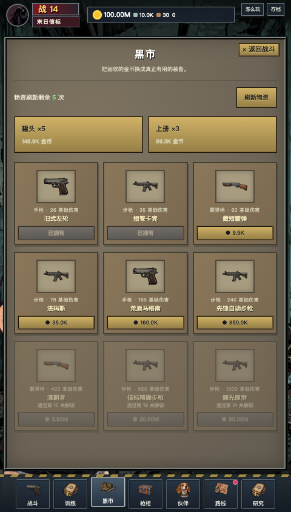
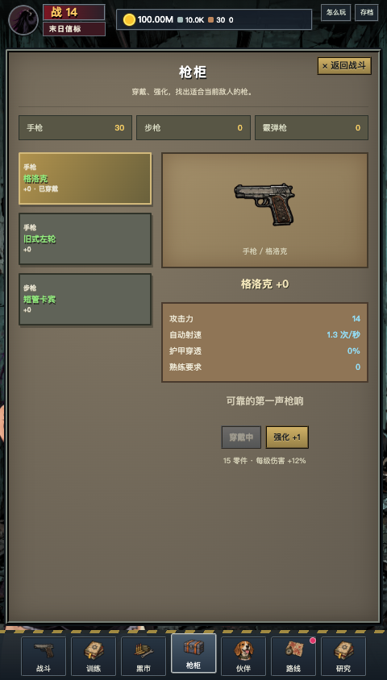
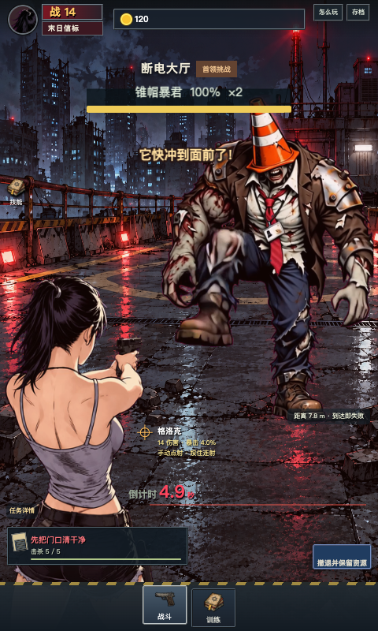
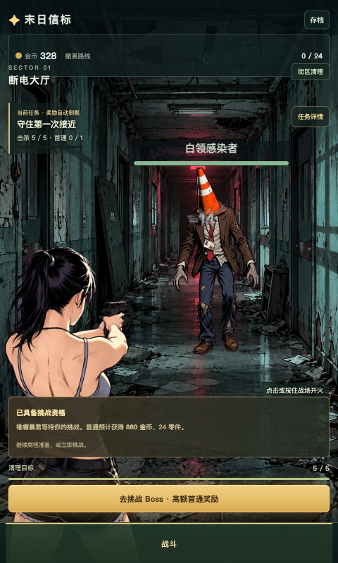
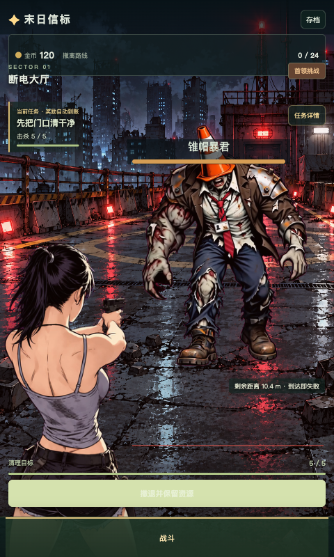
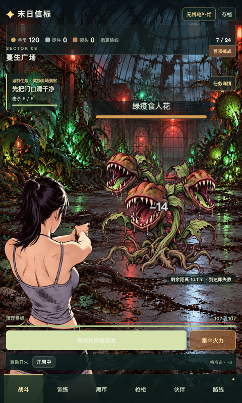
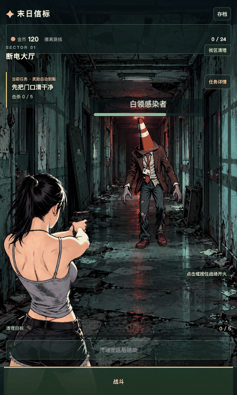

# 末日信标 · ZombieClickerIdle

竖屏点击射击与放置成长的浏览器游戏演示。清理感染者、积累资源、准备装备，再主动挑战不断逼近的首领。任务、成长入口和提示都显示在游戏画面内，随着进度逐步开放。

当前版本：**v0.3 演示（2026-10-01录像复刻更新）**。六个区域、24 关、10 把枪、3 位伙伴、3 份手册、3 条研究、8 项成就与 26 项任务。

## 本次录像复刻

普通怪需要持续命中；未成长直接挑战首领会失败。顶部资源、两侧入口、右下技能／首领、底部图标、纸板市场和分栏枪柜已接入。怪物使用34／48帧Grok视频抽帧，24fps播放，并有子弹轨迹、命中碎屑和倒计时。

| 黑市物品卡 | 枪柜列表与蓝图 | 首领逼近 |
| :---: | :---: | :---: |
|  |  |  |

[录像与玩法/UI记录](docs/research/video-analysis-2026-10-01.md) · [imagegen图标与抽帧来源](docs/assets/2026-10-01-reference-replica.md)

## 前版实机截图

| 普通怪清理与挑战提示 | 楼顶首领逼近 | 温室植物首领 |
| :---: | :---: | :---: |
|  |  |  |

以上均为实际浏览器截图；后两张使用开发验收存档展示首领战。

## 射击动图



动图录制自实际游戏，包含完整 HUD。角色动画由 Grok CLI 图生视频抽帧为透明 Sprite sheet，使用 Phaser 播放。当前主角有抬枪后坐、上身跟随和马尾摆动，胸臀跟随幅度仍较轻；后续可继续精修。

## 核心玩法

- **主动开局**：点击、按住战场或空格射击。普通怪达到目标后，底部挑战按钮点亮，玩家自行决定何时打 Boss。
- **有压力的首领战**：切换独立场景和首领，警报后开始逼近；低血量狂暴加速。集中火力可提升伤害并击退首领，失败撤回保留资源。
- **任务带动成长**：击杀和首通任务自动发奖。新档首次击败首领合计获得 **880 金币、24 零件、3 罐头、3 研究点**，训练在五杀后提前开放。
- **装备与构筑**：买枪、熟练度、强化、伙伴、手册与研究逐步加入，连接手动射击、自动火力与资源回收。
- **放置与存档**：永久自动攻击、免费离线资源回收、本地自动保存、导入与导出。离线不会自动完成首领战。
- **自愿补给**：五个激励广告入口，当前为明确标示的 **3 秒本地模拟**。取消无奖，完成后领取，带去重、冷却和每日额度。

## 功能开放顺序

击杀数与首通数同时满足才会开放功能。时间为共享规则模拟中的累计成长时间，实际操作、阅读、失败与暂停会影响进度；不是强制等待。

| 触发条件 | 开放功能 | 模拟时间参考 |
| --- | --- | --- |
| 普通怪 5 杀 | 128金币、训练、首领资格 | 快速模拟约19秒 |
| 首通 1 关 | 高额首通奖励与下一条路线 | 取决于备战 |
| 25 杀 | 黑市、枪柜、旧式左轮 | 快速模拟约1.6分钟 |
| 60 杀 | 零件强化 | 快速模拟约3.6分钟 |
| 60 杀＋首通 2 关 | 集中火力与首领战术 | 快速模拟约3.6分钟 |
| 120 杀＋首通 3 关 | 路线、图鉴、成就、补给 | 快速模拟约8.2分钟 |
| 300 杀＋首通 3 关 | 永久自动、离线回收 | 快速模拟约22.8分钟 |
| 650 杀＋首通 4 关 | 手册 | 快速模拟约39.3分钟 |
| 1000 杀＋首通 5 关 | 首位伙伴 | 快速模拟约55.3分钟 |
| 2800 杀＋首通 8 关 | 研究 | 快速模拟约164.4分钟 |
| 3500／9000 杀＋首通 9／12 关 | 侦察／机械伙伴 | 随构筑推进 |

完整任务、首领与开放安排见 [当前演示设计](docs/design/demo-v0.3.md)。

## 本地运行

建议使用 **Node.js 22.18+**，以便同时执行直接读取 TypeScript 的规则检查。

```sh
git clone https://github.com/haha2345/ZombieClickerIdle.git
cd ZombieClickerIdle
npm ci
npm run dev
```

打开 <http://127.0.0.1:5174/>。桌面居中竖屏，手机适配竖屏画面。项目使用独立端口和存档键 `zombie-clicker-idle:save:v1`。

| 操作 | 控制 |
| --- | --- |
| 射击 | 点击／按住战场，或空格 |
| 集中火力 | B，功能解锁后可用 |
| 全屏 | F；Esc 退出 |
| 挑战首领 | 目标完成后点击右下亮色首领卡，再在情报页选择挑战 |
| 成长、补给、存档 | 游戏画面内的菜单和弹窗 |

生产构建及本地预览：

```sh
npm run build
npm run preview
```

## 验证与五小时成长目标

```sh
npm run assets:check
npm run check:demo
npm run build
```

规则检查覆盖任务、首通、装备、离线、广告领奖和存档等 17 组断言。经济模拟调用实际游戏规则，验证四种操作／补给策略自然首通 24 关：

| 模拟策略 | 完成时长 |
| --- | ---: |
| 每秒 3 次输入，无广告 | 22.40 小时 |
| 每秒 5 次输入，无广告 | 12.04 小时 |
| 每秒 5 次输入，3 次后期金币补给 | 11.95 小时 |
| 每秒 5 次输入，3 次前期金币补给 | 12.03 小时 |

这包含重复刷资源、准备装备与放置成长，**不代表五小时独立剧情、五小时人工试玩或所有最优策略均需要五小时**。模拟脚本会重新生成 `artifacts/economy-simulation.json`；发布时的报告见 [经济模拟](docs/validation/reference-2026-10-01/economy-simulation.json)。

实际浏览器已完成 [12 组交互检查](docs/validation/reference-2026-10-01/browser-checks.json) 和 [6 组动画检查](docs/validation/reference-2026-10-01/motion-checks.json)，覆盖画面内界面、挑战、广告、离线、存档、全屏、手机布局和真实精灵帧变化。另有[4组本次复刻检查](docs/validation/reference-2026-10-01/reference-checks.json)，覆盖命中特效、密集帧、首领流程与480／390／320px布局。更多普通命中显著延长成长时间，尚未进行完整真人试玩。

浏览器脚本使用外部 Playwright，不改变游戏依赖：

```sh
# 替换为本机已有 Playwright 模块与 Chromium/Chrome 可执行文件
TASK_PLAYWRIGHT_MODULE=/path/to/playwright/index.mjs \
TASK_BROWSER_EXECUTABLE=/path/to/chrome \
TASK_HEADED=1 npm run check:browser

TASK_PLAYWRIGHT_MODULE=/path/to/playwright/index.mjs \
TASK_BROWSER_EXECUTABLE=/path/to/chrome \
node scripts/checks/motion-browser.mjs
```

检查脚本访问 `?test`，使用独立测试存档。

## 技术栈与项目结构

沿用 MyFalloutIdle 的锁定技术栈，保留依赖锁文件。

| 依赖 | 版本 |
| --- | --- |
| Vue | 3.5.43 |
| Phaser | 4.2.1 |
| Vite | 8.3.1 |
| TypeScript | 6.0.3 |
| vue-tsc | 3.3.11 |
| @vitejs/plugin-vue | 6.0.9 |
| @vue/tsconfig | 0.9.1 |
| @types/node | 26.6.3 |

```text
src/app/          唯一游戏状态与 Vue 入口
src/domain/       纯规则、成长与结算
src/content/      关卡、任务、装备、动画配置
src/game/         Phaser 场景与输入
src/ui/           画面内组件与样式
src/services/     本地存档、广告契约
public/assets/    运行图片、透明精灵表及源帧元数据
scripts/          素材打包、规则模拟、浏览器验收
docs/             设计、研究、截图动图与验证报告
art/              素材来源与哈希目录
```

## 演示边界与文档

当前为单机浏览器演示，存档保存在本机浏览器。广告尚未接入真实 SDK 或服务端验证。动画仍有少量轮廓漂移和边缘残色，没有独立软组织骨骼物理。原始录屏、Grok 视频、临时日志、个人配置和构建输出不随仓库提交；运行资源已包含，可以直接构建。

- [当前玩法与开放节点](docs/design/demo-v0.3.md)
- [同类游戏研究与借鉴](docs/research/similar-games-2026-09-30.md)
- [参考录像分析](docs/research/video-analysis.md)
- [架构与存档／广告契约](docs/architecture.md)
- [项目目录说明](docs/project-structure.md)
- [美术流程](docs/assets/README.md)与[动画来源](docs/assets/2026-09-30-hud-motion.md)
- [开发与验收记录](progress.md)
